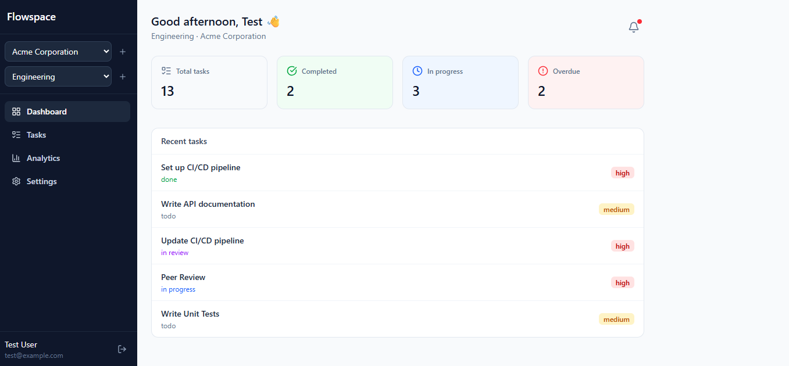
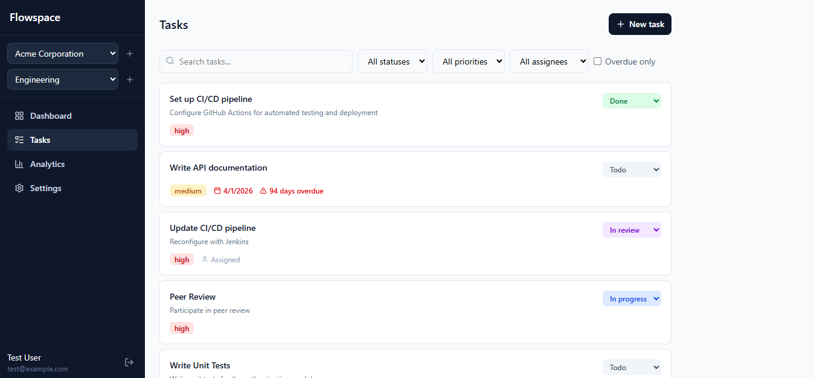
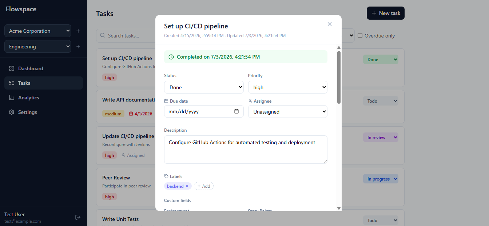
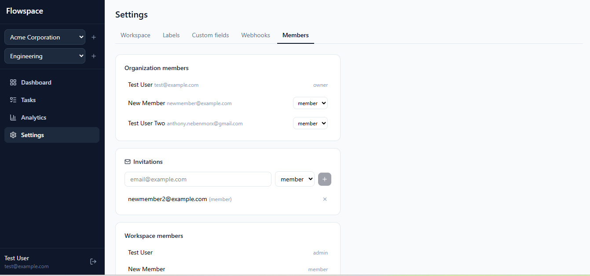
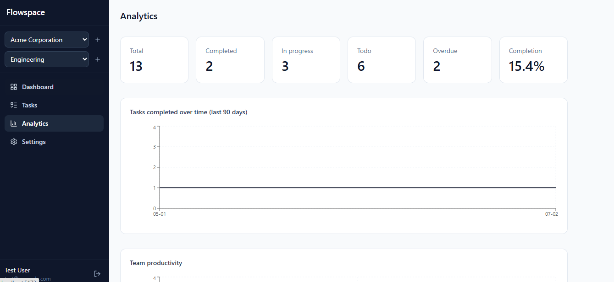
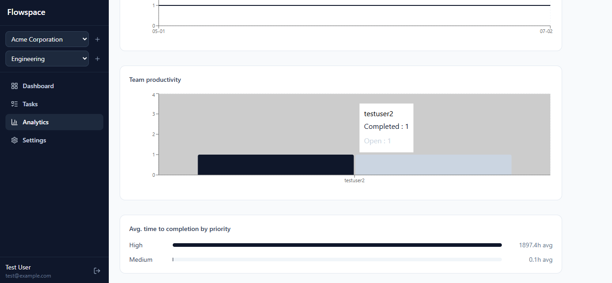

# Flowspace

A production-grade REST + WebSocket API for real-time collaborative task management. Engineered for multi-tenant SaaS workloads — teams can create organizations, spin up workspaces, assign and track tasks in real time, receive notifications, and integrate with external services via webhooks.

**[Demo page](http://localhost:8000/demo) · [Swagger UI](http://localhost:8000/docs) · [Postman Collection](docs/collab-tasks-api.postman_collection.json)**

---

## Screenshots

| Dashboard | Tasks |
|---|---|
|  |  |

| Task detail | Settings |
|---|---|
|  |  |

| Analytics-1 | Analytics-2 |
|---|---|
|  |  |

---

## Architecture highlights

- **Multi-tenant data isolation** — every query is scoped to an organization and workspace; no cross-tenant data leakage by design
- **Real-time sync** — WebSocket rooms per workspace broadcast task changes instantly to all connected clients
- **Async throughout** — FastAPI + SQLAlchemy async + asyncpg; no blocking I/O on the main thread
- **Background job processing** — Celery handles email delivery, webhook dispatch, and scheduled reminders without blocking API responses
- **Resilient webhook delivery** — exponential backoff retry (1 min → 5 min → 30 min → 2 hr → 8 hr) with delivery logging and HMAC-SHA256 signature verification
- **Performant search** — PostgreSQL `tsvector` full-text search with GIN index and auto-update trigger; no Elasticsearch dependency
- **Layered caching** — Redis caches hot task list queries with workspace-scoped invalidation on every write; fails open (falls through to Postgres) if Redis is unavailable
- **Rate limiting** — per-user request limits enforced at middleware level before any route handler runs; fails open if Redis is unavailable
- **Role-based permissions** — workspace roles (`admin` / `member` / `viewer`) gate sensitive actions; changing a task's due date requires `admin`
- **Audit trail** — every task change is recorded with actor, timestamp, old value, and new value

---

## Tech stack

| Layer | Technology |
|---|---|
| Framework | FastAPI 0.133 |
| Database | PostgreSQL 15 (async via `asyncpg`) |
| ORM | SQLAlchemy 2.0 (async) |
| Migrations | Alembic |
| Cache | Redis 7 |
| Task queue | Celery 5.6 + Redis broker |
| Real-time | WebSockets (native FastAPI) |
| Email | Resend API |
| Auth | JWT — `python-jose` |
| Validation | Pydantic v2 |
| Python | 3.13 |

**Frontend**

| Layer | Technology |
|---|---|
| Framework | React 19 + Vite |
| Routing | React Router 7 |
| Data fetching | TanStack Query 5 |
| HTTP client | Axios |
| Styling | Tailwind CSS 4 |
| Charts | Recharts |
| Icons | lucide-react |

---

## Quick start

This repo has two projects — `backend/` (FastAPI) and `frontend/` (React) — plus a root-level `docker-compose.yml` that runs both.

### Option A — Docker (recommended)

One command starts the entire stack: database, cache, API, background workers, **and** the frontend. No local Python, Node, PostgreSQL, or Redis installation needed.

```bash
git clone https://github.com/Nebenmor/flowspace.git
cd flowspace
cp backend/.env.example backend/.env   # add your RESEND_API_KEY
docker-compose up --build
```

Services started:
- `frontend` — React app at `http://localhost:5173`
- `api` — FastAPI at `http://localhost:8000`
- `db` — PostgreSQL at port `5432`
- `redis` — Redis at port `6379`
- `worker` — Celery worker
- `beat` — Celery Beat scheduler

Migrations run automatically on startup. Open `http://localhost:5173` — that's the whole app; its nginx container proxies `/api` and `/ws` through to the backend internally, so there's nothing else to configure.

> `backend/docker-compose.yml` also exists separately, for backend developers who just want the API + its infra without rebuilding the frontend on every change — run it from inside `backend/` the same way. The root-level `docker-compose.yml` above is the one that runs everything.

### Option B — Manual setup

**Prerequisites:** Python 3.13, Node 20+, PostgreSQL, Redis

**Backend:**

```bash
git clone https://github.com/Nebenmor/flowspace.git
cd flowspace/backend

python -m venv venv
source venv/bin/activate        # Windows: venv\Scripts\activate
pip install -r requirements.txt

cp .env.example .env            # fill in your credentials
docker-compose up -d redis      # or run Redis however you prefer

alembic upgrade head
uvicorn app.main:app --reload --host 0.0.0.0 --port 8000
```

**Start background workers** (two separate terminals):

```bash
celery -A app.workers.celery_app worker --loglevel=info --pool=solo
celery -A app.workers.celery_app beat --loglevel=info
```

**Frontend** (in a separate terminal, from the repo root):

```bash
cd frontend
npm install
npm run dev
```

Runs at `http://localhost:5173`. Vite's dev server proxies both `/api` and `/ws` to `http://localhost:8000` (see `vite.config.js`), so no CORS setup or `.env` is needed in development — just make sure the backend above is running first.

---

## Environment variables

Copy `.env.example` to `.env` and fill in the values below.

| Variable | Description |
|---|---|
| `APP_NAME` | Application display name |
| `APP_VERSION` | API version string |
| `DEBUG` | `True` in development, `False` in production |
| `SECRET_KEY` | JWT signing secret — change in production |
| `DATABASE_URL` | PostgreSQL connection string (`postgresql+asyncpg://...`) |
| `ACCESS_TOKEN_EXPIRE_MINUTES` | Access token lifetime (default: 15) |
| `REFRESH_TOKEN_EXPIRE_DAYS` | Refresh token lifetime (default: 7) |
| `BASE_URL` | Public URL of the API (used in emails and links) |
| `RESEND_API_KEY` | API key from [resend.com](https://resend.com) |
| `EMAIL_FROM` | Sender address for transactional emails |
| `REDIS_URL` | Redis connection URL (e.g. `redis://localhost:6379/0`) |

---

## API reference

All routes are versioned under `/api/v1`. Full interactive documentation at `/docs`.

| Resource | Base path |
|---|---|
| Auth | `/api/v1/auth` |
| Organizations | `/api/v1/organizations` |
| Workspaces | `/api/v1/organizations/{org_slug}/workspaces` |
| Members | `/api/v1/organizations/{org_slug}/workspaces/{workspace_slug}/members` |
| Tasks | `/api/v1/organizations/{org_slug}/workspaces/{workspace_slug}/tasks` |
| Subtasks | `.../tasks/{task_id}/subtasks` |
| Dependencies | `.../tasks/{task_id}/dependencies` |
| Labels | `.../workspaces/{workspace_slug}/labels` |
| Custom fields | `.../workspaces/{workspace_slug}/custom-fields` |
| Activities | `.../tasks/{task_id}/activity`, `.../workspaces/{workspace_slug}/activity`, `.../members/{user_id}/activity` |
| Invitations | `/api/v1/invitations` |
| Notifications | `/api/v1/notifications` |
| Webhooks | `/api/v1/organizations/{org_slug}/webhooks` |
| Analytics | `/api/v1/organizations/{org_slug}/workspaces/{workspace_slug}/analytics` |

### Task filtering and search

The task list endpoint supports rich filtering via query parameters:

```
GET /api/v1/.../tasks?status=in_progress&priority=high&assignee_id=...&is_overdue=true&search=pipeline&page=1&page_size=20
```

Search uses PostgreSQL full-text search (`tsvector`) — stemming-aware, GIN-indexed, and significantly faster than `ILIKE` at scale. Results are cached in Redis for 60 seconds and automatically invalidated on any write to the workspace.

### Analytics endpoints

```
GET .../analytics/tasks-summary          # total, completed, overdue counts + completion rate
GET .../analytics/completed-over-time    # tasks completed per day (default: last 30 days)
GET .../analytics/team-productivity      # completed vs open tasks per member
GET .../analytics/time-to-completion     # avg hours/days from creation to completion by priority
```

### Role-based permissions

Each workspace member has a role: `admin`, `member`, or `viewer`. Most task actions (create, comment on status, assign) are open to any workspace member. A few actions are restricted to `admin`:

- Changing a task's **due date** (`PATCH .../tasks/{task_id}` with `due_date`) — returns `403 Forbidden` for non-admins
- Creating labels and custom fields
- Updating or archiving the workspace, and adding workspace members

---

## WebSocket events

Connect: `ws://localhost:8000/ws/{org_slug}/{workspace_slug}?token=<access_token>`

| Event | Direction | Payload |
|---|---|---|
| `user.joined` | server → client | `{ user_id }` |
| `user.left` | server → client | `{ user_id }` |
| `presence.sync` | server → client | `{ online_users: [...] }` |
| `task.created` | server → client | `{ task_id, title, created_by, status, priority }` |
| `task.updated` | server → client | `{ task_id, changes, updated_by }` |
| `task.deleted` | server → client | `{ task_id, deleted_by }` |

---

## Webhook system

Webhooks are org-scoped and fire on configurable events. Every delivery is logged with status and response details. Failed deliveries retry automatically on an exponential backoff schedule: 1 min → 5 min → 30 min → 2 hr → 8 hr.

**Supported events:** `task.created` · `task.updated` · `task.completed` · `task.deleted`

Each request is signed with `HMAC-SHA256`. Verify on your end:

```python
import hmac, hashlib

def verify_signature(secret: str, payload: str, signature: str) -> bool:
    expected = hmac.new(secret.encode(), payload.encode(), hashlib.sha256).hexdigest()
    return hmac.compare_digest(f"sha256={expected}", signature)
```

---

## Rate limiting

All endpoints are rate-limited at **60 requests per minute per user**. Authenticated requests are bucketed by JWT token; unauthenticated requests by IP.

When the limit is exceeded:

```
HTTP 429 Too Many Requests
Retry-After: 47

{ "detail": "Rate limit exceeded. Too many requests.", "retry_after": 47 }
```

---

## Background jobs

| Task | Schedule | Description |
|---|---|---|
| `deliver_webhook_task` | On demand | HTTP delivery of a single webhook event |
| `retry_failed_webhooks` | Every 5 minutes | Requeues failed deliveries due for retry |
| `send_task_assigned_email` | On demand | Email notification on task assignment |
| `send_invitation_email` | On demand | Invitation email to new org members |
| `send_due_date_reminders` | Daily at 08:00 UTC | Emails users about tasks due within 24 hours |

---

## Database migrations

```bash
alembic upgrade head                              # apply all pending migrations
alembic revision --autogenerate -m "description" # generate migration from model changes
alembic downgrade -1                              # roll back one step
alembic history                                   # view migration history
```

---

## Project structure

```
flowspace/
├── docker-compose.yml    # Root-level — runs the ENTIRE stack (backend + frontend) with one command
├── backend/
│   ├── docker-compose.yml  # Backend-only stack (db, redis, api, worker, beat) for backend devs
│   ├── Dockerfile
│   └── app/
│       ├── api/v1/              # Route handlers (one file per resource)
│       ├── core/
│       │   ├── config.py        # Pydantic settings loaded from .env
│       │   ├── dependencies.py  # FastAPI DI — DB session, current user
│       │   ├── exceptions.py    # Global exception handlers
│       │   ├── middleware.py    # Rate limiting middleware
│       │   ├── redis.py         # Redis client singleton
│       │   └── security.py      # JWT and password hashing
│       ├── db/
│       │   ├── models/          # SQLAlchemy ORM models
│       │   ├── migrations/      # Alembic migration scripts
│       │   └── session.py       # Async session factory
│       ├── schemas/             # Pydantic request/response schemas
│       ├── services/            # Business logic layer
│       │   ├── task_service.py
│       │   ├── analytics_service.py
│       │   ├── cache_service.py
│       │   ├── webhook_service.py
│       │   └── notification_service.py
│       ├── static/
│       │   └── demo.html        # Project demo page served at /demo
│       ├── websockets/
│       │   └── manager.py       # WebSocket connection and presence manager
│       ├── workers/
│       │   ├── celery_app.py    # Celery app + beat schedule
│       │   ├── email_tasks.py   # Email delivery tasks
│       │   └── webhook_tasks.py # Webhook dispatch and retry
│       └── main.py              # App entry point and router registration
└── frontend/
    ├── Dockerfile        # Multi-stage build → served via nginx
    ├── nginx.conf        # Proxies /api and /ws to the backend container
    └── src/
        ├── api/                  # One file per resource — thin axios wrappers
        ├── components/           # TaskCard, TaskFilters, TaskDetailModal, NotificationsPanel, Sidebar, Layout
        ├── context/              # AuthContext, WorkspaceContext
        ├── hooks/
        │   └── useWebSocket.js   # Subscribes to /ws/{org_slug}/{workspace_slug}, invalidates queries on task events
        ├── pages/                # Login, Register, Dashboard, Tasks, Analytics, Settings
        ├── utils/
        │   └── taskDates.js      # Shared overdue calculations
        └── App.jsx
```

---

## Feature coverage

The frontend now covers the full backend API:

- Auth (login/register/session)
- Organization & workspace creation, switching, and settings (rename, archive)
- Task CRUD, filtering, search, click-to-view detail with editable fields and full audit history
- Subtasks, task dependencies (searchable picker), labels, and custom fields — all editable from the task detail view
- Real-time task sync over WebSocket
- Notifications panel (list, mark read/all-read)
- Analytics dashboard (all four endpoints)
- Role-gated actions: due-date editing (workspace admin), label/custom-field definitions (workspace admin), invitations/webhooks/role changes (org owner/admin)
- Member invitations, organization role management, and adding existing org members to a workspace
- Webhook configuration and delivery log viewer

All of it lives under **Settings** (workspace, labels, custom fields, webhooks, members tabs) except task-level features, which live in the task detail modal.

**Known gaps**, mostly reflecting the backend's own current shape rather than missing frontend work:
- No endpoint exists to remove a member from a workspace once added (only from an organization, via role changes) — this is a backend limitation, not a frontend one.
- Custom field values and dependency types aren't validated against future-cycle edge cases beyond what the backend already rejects.

---

## Health check

```
GET /health
→ { "status": "ok", "app": "Real-Time Collaborative Task Management API" }
```

---

## License

MIT

---

## Testing

The test suite covers the three most critical flows: authentication, task management, and webhook delivery.

```bash
# Create the test database (first time only)
psql -U postgres -c "CREATE DATABASE collab_tasks_test;"

# Make sure Redis is running
docker-compose up -d redis

# Run all tests
pytest -v
```

**Coverage:** 35 tests across 3 files — `test_auth.py`, `test_tasks.py`, `test_webhooks.py`

| Suite | Tests | What it covers |
|---|---|---|
| Auth | 12 | Register, login, token refresh, protected routes |
| Tasks | 14 | CRUD, filters, search, assignment email trigger, soft delete |
| Webhooks | 9 | CRUD, signature verification, delivery trigger, retry backoff |